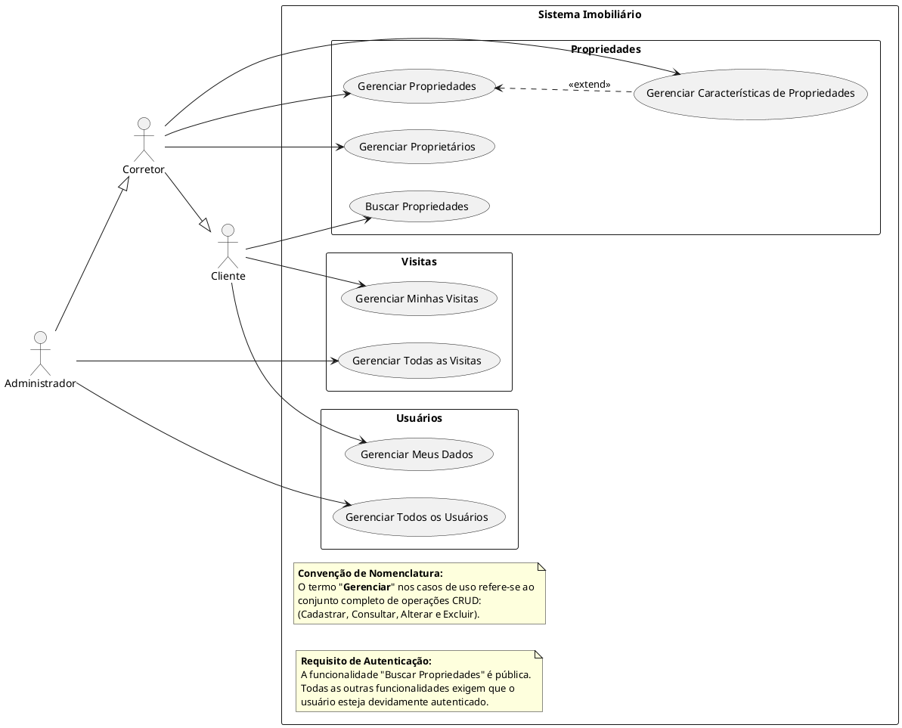

# **Documento de Requisitos: Casos de Uso do Sistema Imobiliário**

**Data:** 13/06/2025

## **1\. Introdução**

Este documento descreve os requisitos funcionais do Sistema Imobiliário através da metodologia de Casos de Uso da UML. O objetivo é detalhar as interações essenciais entre os atores e o sistema, servindo como um guia claro e direto para o desenvolvimento.

## **2\. Sobre a Ferramenta PlantUML**

**O que é PlantUML?**

PlantUML é uma ferramenta de código aberto que permite criar diagramas UML (e outros tipos) a partir de uma linguagem de descrição em texto. Em vez de desenhar visualmente, o desenvolvedor "escreve" o diagrama. Essa abordagem de "diagrama como código" facilita o controle de versão com ferramentas como Git, melhora a colaboração e automatiza a geração de documentação.

Código-fonte do diagrama:

## **3\. Diagrama de Casos de Uso**

O diagrama abaixo, gerado com PlantUML, ilustra as funcionalidades do sistema, os atores que as executam e as relações entre eles.

### **3.1. Análise do Diagrama**

* **Atores:** O sistema define três atores (`Cliente`, `Corretor`, `Administrador`) com uma hierarquia de permissões, onde um ator especializado herda as capacidades do ator base.  
* **Relação `<<extend>>`:** A relação `(ManageProperties) <.. (ManageFeatureTypes) : <<extend>>` indica que `Gerenciar Características` é uma funcionalidade **opcional** que pode ser acessada durante o gerenciamento de uma propriedade.

## **4\. Descrição Detalhada dos Casos de Uso**

### **4.1. Casos de Uso com Operações em Entidade Única**

- **ID:** UC-001
- **Nome do Caso de Uso:** Gerenciar Proprietários
- **Atores:** Corretor, Administrador
- **Tipo de Operação:** CRUD em entidade única (`Owner`).
- **Descrição Breve:** Permite ao ator realizar as operações de cadastro, consulta, alteração e exclusão dos dados de proprietários de imóveis.
- **Pré-condições:** O ator deve estar autenticado com perfil de "Corretor" ou "Administrador".
- **Pós-condições:** Os dados de um proprietário são criados, atualizados ou removidos do sistema.

- **Fluxo Principal:**

1. O ator acessa a funcionalidade e visualiza a lista de proprietários existentes.  
2. O ator escolhe a operação desejada (adicionar, editar ou excluir).  
3. Para adição ou edição, o ator preenche o formulário com os dados do proprietário e confirma.  
4. O sistema valida os dados e persiste a alteração no banco de dados.

- **ID:** UC-002
- **Nome do Caso de Uso:** Gerenciar Características de Propriedades
- **Atores:** Corretor, Administrador
- **Tipo de Operação:** CRUD em entidade única (`FeatureType`).
- **Descrição Breve:** Permite ao ator gerenciar os tipos de características que podem ser atribuídas a um imóvel (ex: "Piscina", "Nº de Quartos").
- **Pré-condições:** O ator deve estar autenticado com perfil de "Corretor" ou "Administrador".
- **Pós-condições:** Um tipo de característica é criado, alterado ou removido do sistema.

- **Fluxo Principal:**
1. O ator acessa a funcionalidade e visualiza a lista de características existentes.  
2. O ator seleciona a operação desejada.  
3. Para adição ou edição, preenche o nome da característica e confirma.  
4. O sistema valida e salva a nova característica.

- **ID:** UC-003 
- **Nome do Caso de Uso:** Gerenciar Meus Dados 
- **Atores:** Cliente, Corretor, Administrador 
- **Tipo de Operação:** CRUD em entidade única (`User`). 
- **Descrição Breve:** Permite que um usuário autenticado consulte e edite suas próprias informações cadastrais. 
- **Pré-condições:** O ator deve estar autenticado no sistema. 
- **Pós-condições:** Os dados pessoais do usuário autenticado são atualizados. 

- **Fluxo Principal:**

1. O ator acessa a sua página de perfil ou conta.  
2. O ator edita os campos desejados (nome, telefone, senha).  
3. O ator confirma as alterações.  
4. O sistema valida os dados e atualiza o registro do usuário.

- **ID:** UC-004
- **Nome do Caso de Uso:** Gerenciar Todos os Usuários*
- **Atores:** Administrador 
- **Tipo de Operação:** CRUD em entidade única (`User`). 
- **Descrição Breve:** Permite ao Administrador consultar, alterar o perfil e ativar/desativar qualquer conta de usuário no sistema. 
- **Pré-condições:* O ator deve estar autenticado com o perfil de "Administrador". **Pós-condições:** O status ou o perfil de um usuário selecionado é atualizado. 

- **Fluxo Principal:**

1. O Administrador acessa o painel de gerenciamento de usuários.  
2. O sistema exibe a lista de todos os usuários.  
3. O Administrador seleciona um usuário e realiza a alteração desejada (ex: muda o perfil para "Corretor").  
4. O sistema aplica a modificação.

### **4.2. Casos de Uso com Operações em Múltiplas Entidades**

- **ID:** UC-005 
- **Nome do Caso de Uso:** Gerenciar Propriedades 
- **Atores:** Corretor, Administrador 
- **Tipo de Operação:** CRUD em múltiplas entidades (`Property`, `Address`, `PropertyFeature`). 
- **Descrição Breve:** Permite ao Corretor realizar o cadastro e a edição de um imóvel, associando seu endereço, proprietário e características. 
- **Pré-condições:** O ator deve estar autenticado com perfil de "Corretor" ou "Administrador". 
- **Pós-condições:** Um imóvel é criado ou atualizado no sistema, juntamente com seus dados associados. 

- **Fluxo Principal:**

1. O ator seleciona a opção para cadastrar ou editar um imóvel.  
2. O sistema apresenta um formulário para preenchimento dos dados do imóvel, endereço e seleção do proprietário.  
3. O ator informa os valores para as características desejadas (ex: Nº de Quartos \= 3).  
4. O ator submete o formulário, o sistema valida e salva os registros nas tabelas relacionadas.

- **ID:** UC-006 
- **Nome do Caso de Uso:** Buscar Propriedades 
- **Atores:** Cliente, Corretor, Administrador, Visitante (Público) 
- **Tipo de Operação:** Operação de leitura em múltiplas entidades. 
- **Descrição Breve:** Permite a qualquer usuário encontrar imóveis no catálogo através de filtros de busca. 
- **Pré-condições:** Nenhuma. 
- **Pós-condições:** O sistema exibe uma lista de imóveis que correspondem aos critérios de busca. 

- **Fluxo Principal:**

1. O usuário acessa a página de busca de imóveis.  
2. O usuário preenche os filtros desejados (ex: localização, preço, nº de quartos).  
3. O usuário aciona a busca.  
4. O sistema exibe a lista de resultados correspondentes.

- **ID:** UC-007 
- **Nome do Caso de Uso:** Gerenciar Minhas Visitas 
- **Atores:** Cliente, Corretor, Administrador 
- **Tipo de Operação:** CRUD em múltiplas entidades (`Visit`, `Property`, `User`).
- **Descrição Breve:** Permite que um cliente solicite o agendamento de uma visita a um imóvel e, posteriormente, visualize ou cancele suas visitas agendadas. 
- **Pré-condições:** O ator deve estar autenticado. 
- **Pós-condições:** Uma nova solicitação de visita é criada com status "Pendente", ou uma visita existente é cancelada. 

- **Fluxo Principal:**

1. O Cliente, na página de um imóvel, clica em "Agendar Visita".  
2. O sistema exibe um calendário, e o Cliente seleciona uma data e horário.  
3. O Cliente confirma a solicitação.  
4. O sistema cria o registro da visita, associando o imóvel e o usuário.

- **ID:** UC-008 
- **Nome do Caso de Uso:** Gerenciar Todas as Visitas 
- **Atores:** Administrador 
- **Tipo de Operação:** CRUD em múltiplas entidades (`Visit`, `Property`, `User`). 
- **Descrição Breve:** Permite ao Administrador visualizar todas as solicitações de visita para aprová-las ou reprová-las. 
- **Pré-condições:** O ator deve estar autenticado com perfil de "Administrador". 
- **Pós-condições:** O status da visita selecionada é atualizado para "Aprovada" ou "Rejeitada". 

- **Fluxo Principal:**

1. O Administrador acessa o painel de gerenciamento de visitas.  
2. O sistema exibe a lista de solicitações, e o Administrador seleciona uma que esteja pendente.  
3. O Administrador escolhe a opção "Aprovar" ou "Reprovar".  
4. O sistema atualiza o status do registro da visita.  
